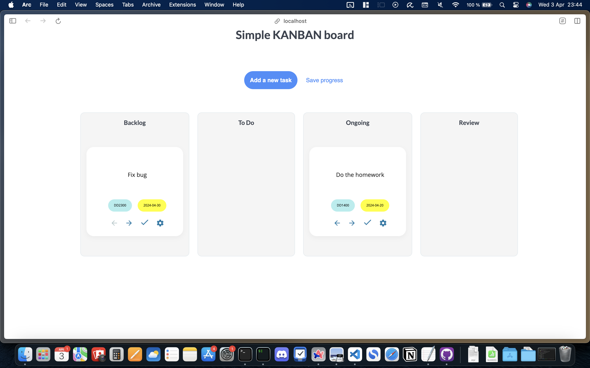

# A KANBAN Board

A CRUD (Create, Remove, Update, Delete) web app that enables you to manage your tasks using the KANBAN model.

Tech stack: React, PostgreSQL, NodeJS

## To run the web app

1. Clone this repository and install the necessary packages.
2. Open two terminal windows.
3. In terminal window 1: Go to server folder and run "node index.js".
4. In terminal window 2: Go to client folder and run "npm start".
3. In terminal window 1: Go to server folder and run "node index.js"  
4. In terminal window 2: Go to client folder and run "npm start"  

