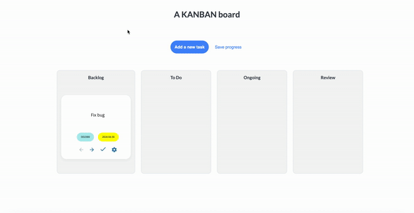

# Welcome to my KANBAN Board Demo 🚀



## About

KANBAN Board is not just another task manager; it's your ultimate companion in task organization. Powered by the sleek combination of React, Supabase, and NodeJS, this CRUD (Create, Remove, Update, Delete) web app revolutionizes your productivity game.

## Features

- Intuitive KANBAN model for seamless task management.
- CRUD operations to keep your workflow agile.
- Cutting-edge tech stack ensures top-notch performance and reliability.


## Installation

1. **Clone this Repository**: Grab a copy of my cool KANBAN Board from GitHub.
2. **Install Dependencies**: Fire up your terminal and install all the necessary packages. You might use npm or yarn for this.
3. **Start the Engines**: Get ready for action by running the server and client.

```bash
# Terminal Window 1
cd server
node index.js

# Terminal Window 2
cd client
npm start
```